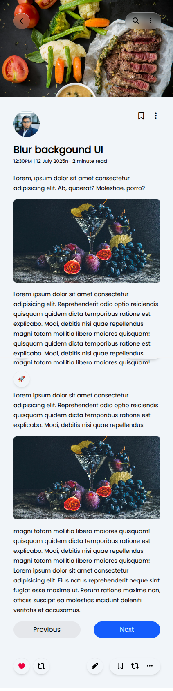
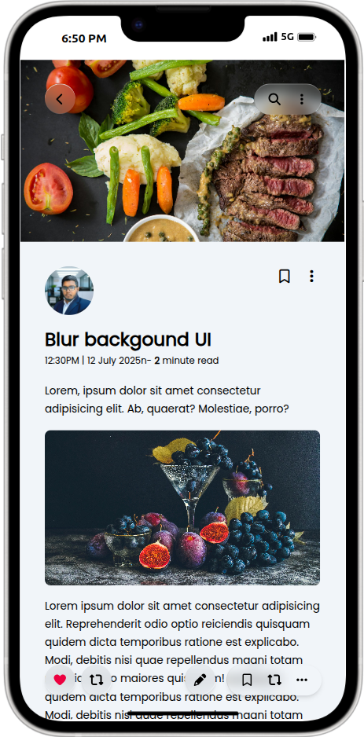

# 📱 Blur Background UI — Tailwind CSS Practice

This is a modern blog post UI designed using **HTML** and **Tailwind CSS**, focused on demonstrating layout structuring, image presentation, and mobile responsiveness.

The design features:
- A food-themed hero banner
- Profile section with avatar and interaction icons
- Blog content with blurred background UI concept
- Responsive layout with action buttons
- Navigation controls at the bottom

---

## 🌐 Full Page Preview



---

## 📱 Mobile Phone Frame Preview
 
<div style='display:grid; grid-template-column: repeat(2, 1fr)'>

 

</div>

---

## 🚀 Technologies Used

- **HTML5**
- **Tailwind CSS**

---

## 📂 Project Structure

```plaintext
project-root/
├── index.html
├── styles/
│ └── tailwind.css (or CDN if used inline)
├── assets/
│ ├── screenshots/
│ │ ├── full-page.png
│ │ └── phone-frame.png
└── README.md
```