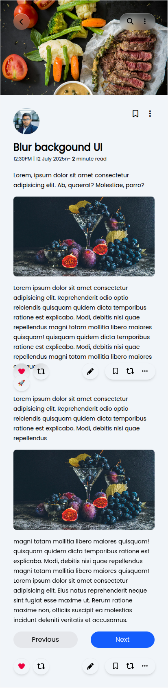

# 📱 Blur Background UI — Tailwind CSS Practice

This is a modern blog post UI designed using **HTML** and **Tailwind CSS**, focused on demonstrating layout structuring, image presentation, and mobile responsiveness.

The design features:
- A food-themed hero banner
- Profile section with avatar and interaction icons
- Blog content with blurred background UI concept
- Responsive layout with action buttons
- Navigation controls at the bottom

---

## 🌐 Full Page Preview

---

## 📱 Mobile Phone Frame Preview

> _(Add a screenshot of the same page displayed on a phone with a phone frame here)_

---

## 🚀 Technologies Used

- **HTML5**
- **Tailwind CSS**

---

## 📂 Project Structure

